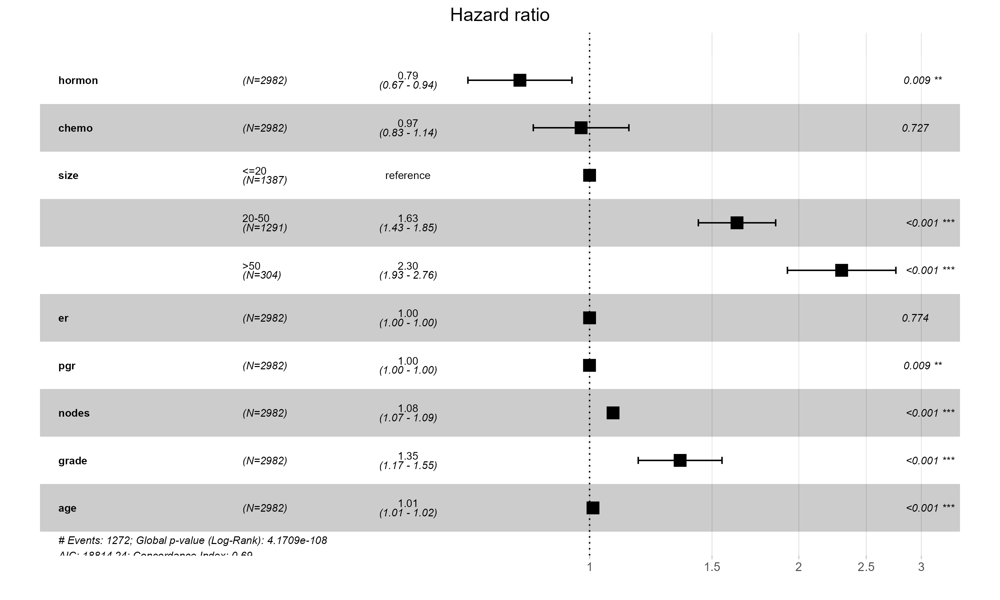
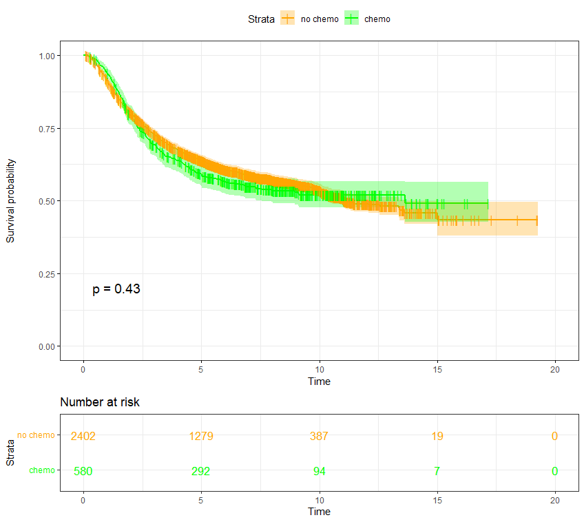
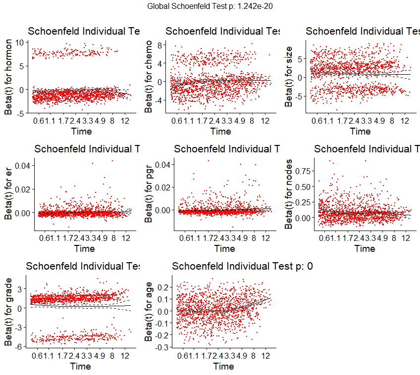

## 📊 Key Results

### 1. Hazard Ratios (Forest Plot)

*Figure 1: Forest plot demonstrating the hazard ratios for various covariates. Age and Grade show statistically significant effects.*

### 2. Survival Probability (Kaplan-Meier)

*Figure 2: Kaplan-Meier estimates comparing survival probabilities between chemotherapy (green) and no-chemotherapy (orange) groups (p = 0.43).*

---

### 📉 Model Diagnostics (Click to Expand)

<b>Click here to see the Schoenfeld Residuals Test</b> (Validity Check)

### Proportional Hazards Assumption

*Figure 3: Global Schoenfeld Test (p < 0.05) indicates the Proportional Hazards assumption may be violated for some variables.*

