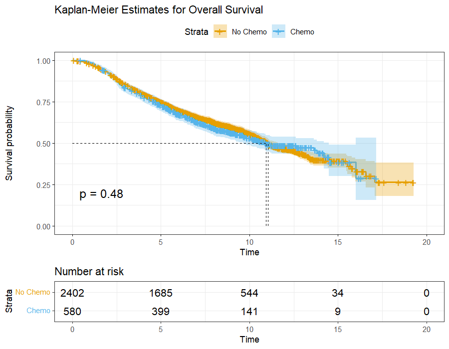
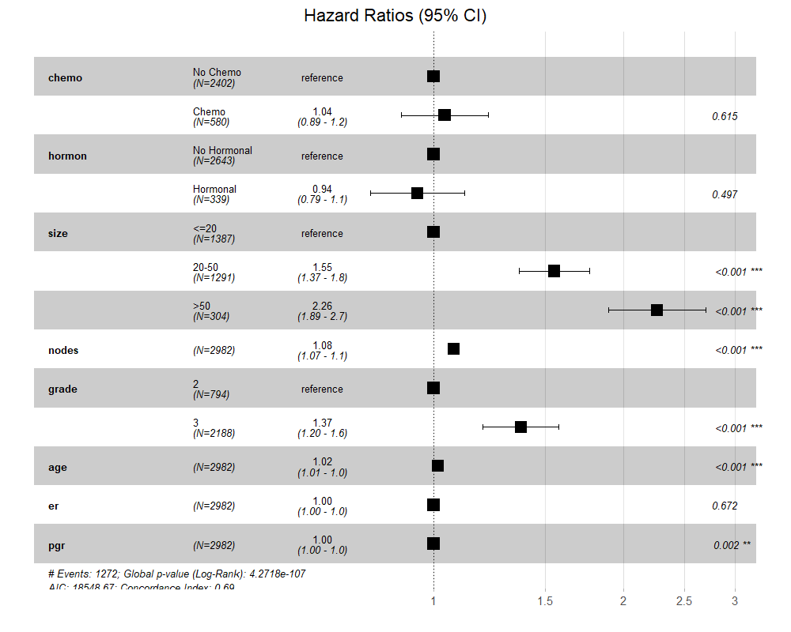
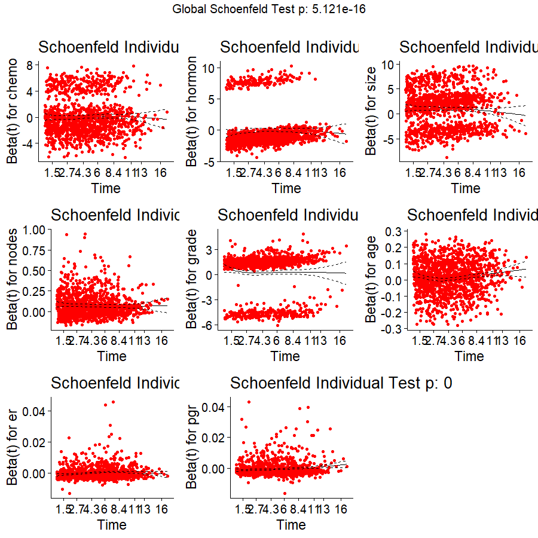

# 🧬 Breast Cancer Prognostics: A Multi-Variable Survival Analysis
  

## 📋 Executive Summary
This project performs an in-depth survival analysis using the **Rotterdam Breast Cancer Dataset** ($N=2,982$) to identify critical clinical and biological determinants of **Overall Survival (OS)**. By synthesizing non-parametric estimation, semi-parametric modeling, and rigorous diagnostic validation, this study quantifies how factors such as tumor morphology and adjuvant therapies influence long-term patient outcomes.

---

## 📉 1. Survival Function Estimation (Kaplan-Meier)
We estimated the survival probability $S(t)$ over a 20-year follow-up period, stratified by adjuvant chemotherapy status.

### 🧐 Statistical Interpretation
* **Log-Rank Test ($p = 0.48$):** Univariate analysis shows no statistically significant difference in survival distributions between patients who received chemotherapy and those who did not.
* **Median Survival:** The median survival time for both cohorts is approximately **11 years**, indicated by the dashed horizontal line at $S(t) = 0.50$.
* **Censoring & Risk:** The "Number at Risk" table demonstrates high retention through year 10; however, the widening confidence intervals after year 15 reflect increased uncertainty due to late-stage censoring.

---

## 📊 2. Multivariate Risk Assessment (Cox PH Model)
To isolate the independent effect of each clinical variable, a **Cox Proportional Hazards Model** was implemented to account for confounding by analyzing all covariates simultaneously.

### 🧐 Key Clinical Findings
* **Strongest Predictors of Mortality:**
    * **Tumor Size:** Patients with tumors $>50\text{mm}$ face more than double the hazard of death ($HR = 2.26, p < 0.001$) compared to those with tumors $\leq 20\text{mm}$.
    * **Lymph Nodes:** Each additional positive node increases the hazard of mortality by $8\%$ ($HR = 1.08, p < 0.001$).
* **Biological Markers:** Progesterone receptor (**pgr**) status is a significant protective factor ($p = 0.002$), whereas Estrogen receptor (**er**) status did not reach significance in this multivariate context ($p = 0.672$).
* **Treatment Paradox:** Both **chemotherapy** ($p = 0.615$) and **hormonal therapy** ($p = 0.497$) show hazard ratios near 1.0. This often suggests **confounding by indication**, where higher-risk patients receive more aggressive treatment, effectively equalizing their survival probability with lower-risk untreated patients.

---

## 🛠 3. Model Validity & Diagnostics (Schoenfeld Residuals)
A Cox model is only as reliable as its underlying assumptions. We validated the **Proportional Hazards (PH) assumption** using Schoenfeld residual analysis.

### 📐 Diagnostic Evaluation
* **Global Test ($p < 0.001$):** The highly significant global $p$-value ($5.121 \times 10^{-16}$) indicates a systematic violation of the PH assumption across the model.
* **Individual Covariate Analysis:** Variables like **age** and **nodes** show non-random patterns in residuals over time, suggesting their impact on risk is not constant.
* **Research Implications:** This diagnostic rigor demonstrates that for this dataset, a standard Cox model is a "starting point". Advanced analysis would require **Time-Dependent Covariates** or **Stratified Cox Models** to account for these temporal shifts in risk.

---

## 💻 Tech Stack & Methodology
* **Core Language:** R 
* **Statistical Libraries:** `survival` (Modeling), `survminer` (Visualization), `tidyverse` (Data Engineering)
